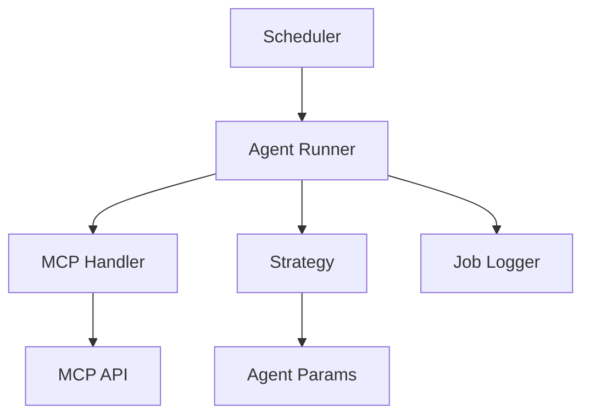

# 🤖 lol-agent-hub

**Living On Logic Agent Hub**  
A centralized interface for managing, monitoring, and scaling decentralized agents running across multiple MCP servers.

---

## 🔍 What is `lol-agent-hub`?

The `lol-agent-hub` is the main control plane for agents in the **Living On Logic** ecosystem. It enables you to create, deploy, schedule, and monitor autonomous agents that interact with MCP servers to execute tasks in finance, governance, trading, sentiment analysis, and more.

---

## 🧠 Core Features

- 🧠 **Agent lifecycle management** (create, edit, delete, pause, resume)
- ⚙️ **Modular execution engines** (REST, GraphQL, WebSockets)
- 🔒 **Secure key management** via wallet integrations
- 🧾 **Job logging** with rich metadata and timestamps
- 📡 **Multi-MCP agent orchestration**
- 🧱 **Plugin support** for custom logic (strategies, filters, validators)
- 📊 **Dashboards** for live agent activity and error tracking

---

## 🌐 Example Use Cases

| Agent Type      | Example Task                                               |
| --------------- | ---------------------------------------------------------- |
| 💹 Trade Agent  | Fetch price data → run strategy → execute buy/sell         |
| 🧾 Feed Agent   | Aggregate sentiment or volume data for other modules       |
| 🗳️ Voting Agent | Monitor DAO proposals and auto-vote based on a policy file |
| 🔐 Wallet Agent | Sign or forward verified MCP events to secure multisigs    |

---

## 📦 Project Structure

```
/src
  /agents         → Core agent definitions and runners
  /services       → MCP service wrappers and network tools
  /strategies     → Custom agent logic (per agent type)
  /storage        → Local/remote job logs and snapshots
  /config         → Agent metadata + MCP endpoints
```

---

## 🛠️ Getting Started

### 1. Clone the repo

```bash
git clone https://github.com/LivingOnLogic/lol-agent-hub.git
cd lol-agent-hub
```

### 2. Install dependencies

```bash
npm install
```

### 3. Configure environment

```env
AGENT_WALLET_PRIVATE_KEY=...
REGISTRY_URL=https://registry.livingonlogic.xyz
MCP_ENDPOINT=https://mcp.example.net
```

### 4. Run agent daemon

```bash
npm run start
```

Agents will start running based on `/config/agents.json` and MCP availability.

---

## 🧬 Agent Structure

Example agent file:

```json
{
  "id": "agent-123",
  "name": "Binance Price Trader",
  "description": "Fetches price every 5s and places orders",
  "interval": 5000,
  "modules": ["binance.price", "binance.order"],
  "strategy": "sma-crossover",
  "params": {
    "symbol": "ETH/USDT",
    "threshold": 0.5
  }
}
```

---

## 🧪 Local Testing

- Run `npm run mock` to simulate MCP responses
- Use the built-in mock wallet at `src/lib/mockWallet.ts`
- Logs are saved in `/storage/logs/*.json` and rotated every 24h

---

## 📡 Architecture



---

## 🔒 Security

- Wallet keys never leave local runtime
- Agents use `ethers.Wallet.connect()` for ephemeral signing
- All external data passed through sanitization middleware
- Optional log redaction for sensitive data
